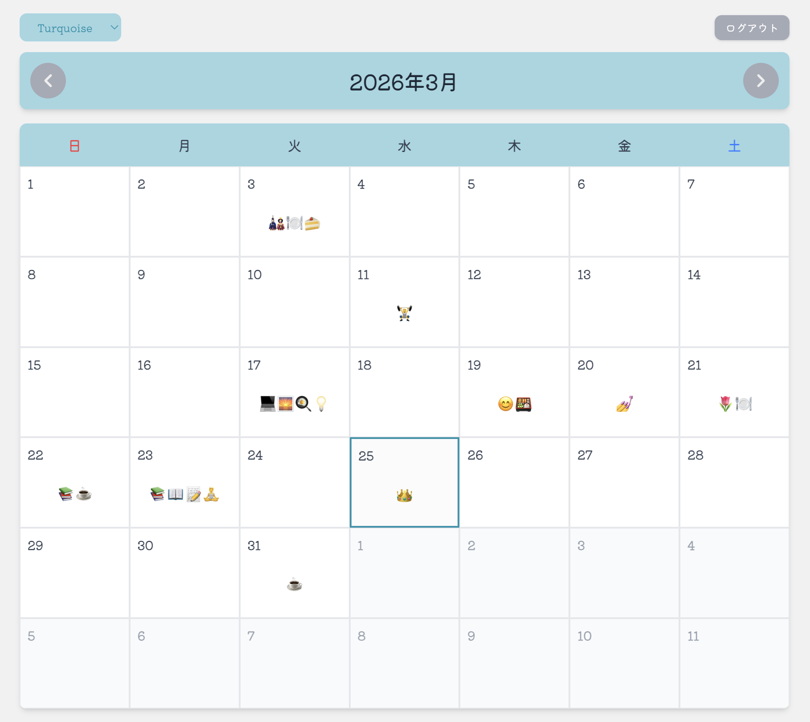
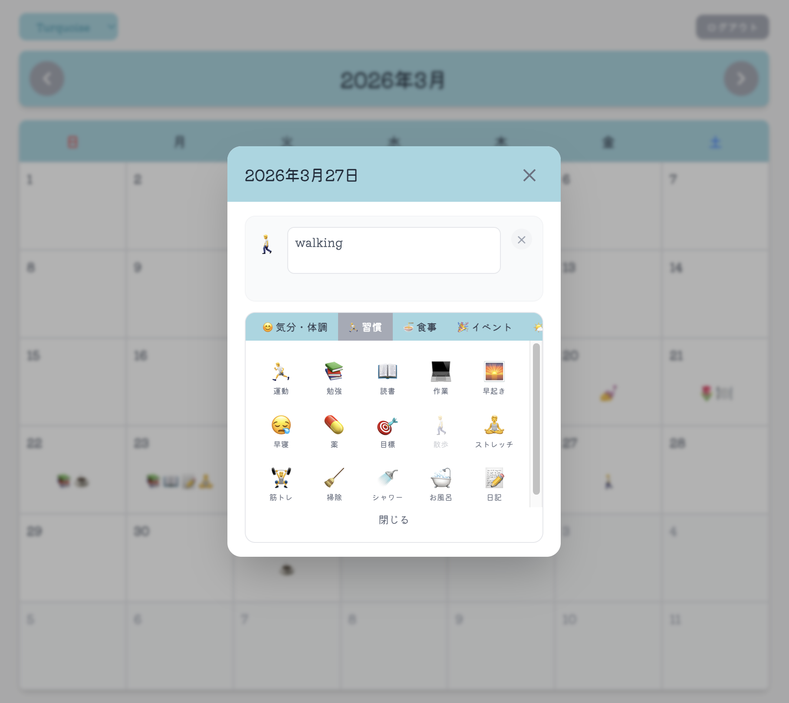
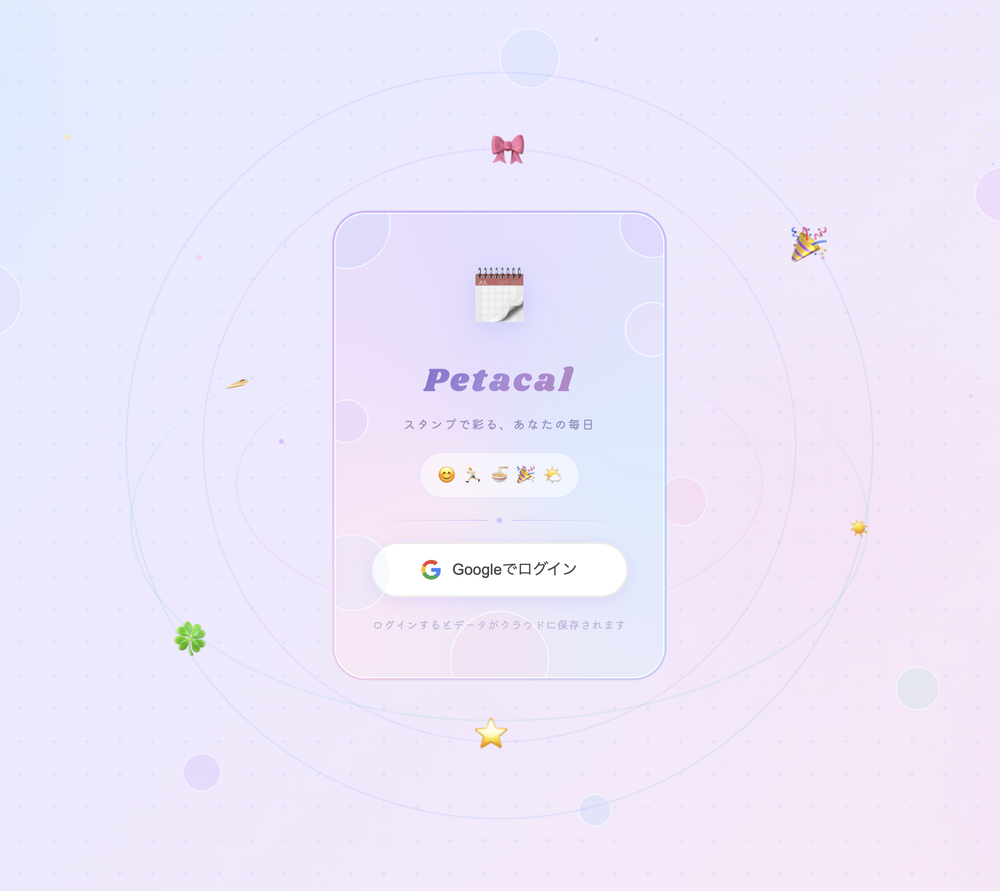

# Petacal
 
手帳型カレンダーに小さなシールを貼る、あのシンプルなスケジュール管理をWebで再現したカレンダーアプリです。  
細かい時間設定に縛られず、その日の気分や活動を「スタンプ」として記録することに特化しています。

Petacal is a web-based calendar application designed for activity tracking through digital stamps, inspired by the practice of using stickers in physical planners.
 
**Demo**: [https://petacal.vercel.app/](https://petacal.vercel.app/)
 
| Calendar | Stamp Picker | Login |
|---|---|---|
|  |  |  |
 
---
 
## 技術仕様 / Technical Specifications
 
1. セキュリティとプライバシー / Security & Privacy

   ユーザーデータの機密性を担保するため、以下の暗号化プロトコルを実装している。  
   To ensure the confidentiality of user data, the following cryptographic protocols are implemented:

    - **クライアントサイド暗号化 / Client-side Encryption**  
    Web Crypto API を利用し、スタンプに付随するコメントを AES-GCM モードで暗号化し保存。  
    encrypted using AES-GCM via the Web Crypto API before being transmitted to the database.
    - **鍵派生 / Key Derivation**  
    ユーザー固有のIDとランダムソルトを用い、PBKDF2で暗号鍵を派生。  
    Encryption keys are derived from unique user IDs using PBKDF2 with a random salt.
    - **アクセス制御 / Access Control**  
    SupabaseのRLSポリシーにより、全操作をユーザーID単位で厳格に分離。  
    Strict Row Level Security (RLS) policies in Supabase isolate all CRUD operations by user ID.

1. データエンジニアリング / Data Engineering

    データの整合性とパフォーマンスを最適化するため、以下の設計を採用している。  
    The database schema and logic are optimized for referential integrity and performance.

    - **スキーマの正規化 / Data Engineering**  
    冗長なカラムを排除し、マスターデータからのIDルックアップ方式を採用。  
    Redundant metadata was removed from the `stamps` table in favor of an ID-based lookup system from master data.
    - **自動クリーンアップ / Automated Cleanup**  
    スタンプ全削除時に、孤立したday_dataレコードを自動的に削除するロジックを実装。  
    Logic is implemented to delete orphaned `day_data` records when the last associated stamp is removed.

1. フロントエンド構成 / Frontend Architecture

    Next.js 15の機能を活用し、効率的なインターフェースを構築している。  
    The application leverages Next.js 15 and modern state management patterns.

    - **状態の永続化 / State Persistence**  
    表示月をURLクエリパラメータと同期し、ブラウザのリロード後も表示状態を維持。  
    The displayed month is synchronized with URL query parameters to maintain state across page reloads.
    - **I/Oの最適化 / I/O Optimization**  
    コメント保存に500msのデバウンスを適用し、データベースへの書き込み頻度を抑制。  
    A 500ms debounce is applied to comment updates to minimize database write frequency and optimize network traffic.

---
 
## 技術スタック / Tech Stack
 
| Category | Technology |
|---|---|
| Framework | Next.js 15 (App Router) |
| Language | TypeScript |
| Styling | Tailwind CSS v4 |
| Database | Supabase (PostgreSQL) |
| Auth | Supabase Auth (Google OAuth) |
| Hosting | Vercel |
 
---
 
## License
 
MIT License
